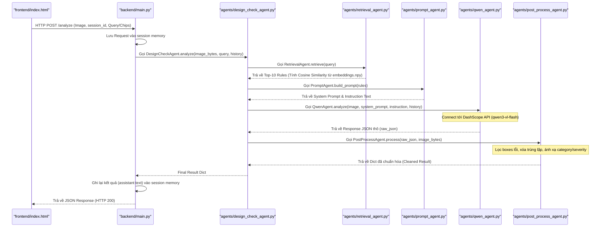
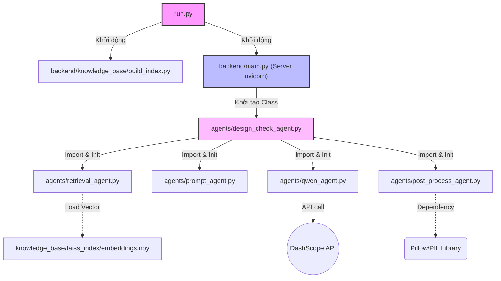

# Flow & Kiến trúc Dự án — Design Check AI

## Tổng quan

**Design Check AI** là hệ thống kiểm tra lỗi thiết kế 2D (poster, logo, layout…) bằng cách kết hợp:
- **RAG** (Retrieval-Augmented Generation) dùng Multilingual Embedding (SentenceTransformers) để tìm design rules liên quan, hỗ trợ đa ngôn ngữ (Tiếng Việt/Anh)
- **Qwen3-VL** (Vision-Language Model) để phân tích ảnh và phát hiện vi phạm
- **Session Memory** (in-memory) để ghi nhớ hội thoại/câu hỏi theo `session_id` hoặc `user_id`
- **FastAPI** backend + **HTML/JS** frontend

---

## Cấu trúc thư mục

```
qwen3v/
├── run.py                          # CLI tiện ích khởi động hệ thống
├── backend/
│   ├── main.py                     # FastAPI server (entry point backend)
│   ├── memory_store.py             # In-memory session memory (queries + turns)
│   ├── requirements.txt            # Thư viện Python cần thiết
│   ├── agents/
│   │   ├── __init__.py
│   │   ├── design_check_agent.py   # Orchestrator điều phối pipeline
│   │   ├── retrieval_agent.py      # Tìm kiếm design rules (TF-IDF)
│   │   ├── prompt_agent.py         # Xây dựng multimodal prompt
│   │   ├── qwen_agent.py           # Gọi Qwen VL API + chat text-only
│   │   └── post_process_agent.py   # Validate & làm sạch output
│   └── knowledge_base/
│       ├── build_index.py          # Script xây Embedding index
│       └── faiss_index/            # Index đã build (npy, json)
├── design_rules/                   # Knowledge base (file Markdown)
│   ├── color_theory.md
│   ├── typography.md
│   ├── layout_rules.md
│   ├── logo_design.md
│   ├── poster_design.md
│   ├── icon_design.md
│   └── pattern_design.md
└── frontend/
    └── index.html                  # Giao diện web người dùng
```

---

## Luồng chạy chính

### Bước 0 — Chuẩn bị (chạy 1 lần)

```
python run.py all
    ├── pip install -r requirements.txt   (install thư viện)
    └── python build_index.py             (build TF-IDF index)
```

`build_index.py` đọc 7 file `.md` trong `design_rules/`, chunking từng Rule block
riêng lẻ (regex `Rule N — Title`), tạo sentence embeddings (384D) thông qua
model `paraphrase-multilingual-MiniLM-L12-v2` và lưu 2 file xuống `faiss_index/`:
- `embeddings.npy`
- `metadata.json`
- `metadata.json`

### Bước 1 — Khởi động server

```
python run.py serve
    └── uvicorn main:app --reload
```

`main.py` (FastAPI) mount frontend tại `/static`, expose 3 endpoints:
| Endpoint     | Method | Mô tả                               |
|--------------|--------|--------------------------------------|
| `/`          | GET    | Serve `frontend/index.html`          |
| `/health`    | GET    | Kiểm tra server còn sống             |
| `/analyze`   | POST   | Nhận ảnh → trả JSON kết quả phân tích|
| `/chat`      | POST   | Chat text-only (có nhớ theo session) |

### Bước 2 — Người dùng upload ảnh

Người dùng truy cập giao diện web (`index.html`), chọn các "Chip" thể loại thiết kế (Logo, Poster, Typography...) hoặc nhập Query tùy chọn, sau đó upload ảnh thiết kế.
Frontend sẽ gom các chip đã chọn + câu hỏi thành một query tổng hợp và POST form-data lên endpoint `/analyze` với:
- `file` (bắt buộc)
- `session_id` (tự sinh và lưu ở `localStorage`, để backend nhớ lịch sử)
- `query` (tuỳ chọn; nếu để trống backend dùng `query` gần nhất trong session)

### Bước 3 — Pipeline phân tích (trong `/analyze`)

Luồng xử lý từ khi FastAPI nhận được request hình ảnh tới lúc trả về kết quả JSON cho frontend:




### Bước 4 — Hiển thị kết quả

Frontend (`index.html`) nhận JSON, vẽ bounding boxes lên ảnh canvas và hiển thị
danh sách lỗi kèm severity, category, và mô tả vi phạm (dùng schema rút gọn).

---

## Chú thích schema JSON rút gọn

### Output chính của `/analyze`

Backend trả về dạng:

```json
{
  "e": [
    {
      "c": [x1, y1, x2, y2],
      "r": "Specific explanation referencing the rule",
      "s": "minor|major|critical",
      "g": "color_theory|typography|layout_rules|logo_design|poster_design|icon_design|pattern_design|general"
    }
  ],
  "isz": { "w": W, "h": H },
  "te": N,
  "ss": { "minor": n1, "major": n2, "critical": n3 }
}
```

Trong đó:
- **`e`**: errors (danh sách lỗi)
- **`c`**: coordinates (box_2d) = `[x1, y1, x2, y2]`
- **`r`**: reason (mô tả lỗi, không giới hạn độ dài)
- **`s`**: severity
- **`g`**: category (design domain)
- **`isz`**: image size
  - `w`: width
  - `h`: height
- **`te`**: total errors
- **`ss`**: severity summary (key vẫn là `minor|major|critical`)

---

## Luồng chat text-only (`/chat`)

Frontend có khung chat và gọi:

```
POST /chat
Content-Type: application/json

{
  "message": "...",
  "session_id": "..."
}
```

Workflow:
- key = `session_id || user_id || "anonymous"`
- backend lấy turns gần nhất trong session → build `history_messages`
- gọi `QwenAgent.chat_text(system_prompt, user_text, history_messages)`
- lưu thêm 2 turns (user + assistant) vào `MemoryStore`

---

## Tóm tắt từng file code

### `run.py`
Script CLI tiện ích với 4 lệnh: `install`, `build-index`, `serve`, `all`.
Dùng `subprocess` để gọi pip install, build_index.py, và uvicorn.
Không chứa logic nghiệp vụ, chỉ là wrapper điều phối.

---

### `backend/main.py`
FastAPI application. Lazy-load `DesignCheckAgent` (khởi tạo lần đầu khi có request).
Có thiết lập `os.environ["USE_TF"] = "0"` ở đầu file để bypass lỗi DLL của TensorFlow trên Windows khi import transformers.
Xử lý validation đầu vào (file type, size tối đa 10MB) và ánh xạ exceptions ra
HTTP status codes tương ứng (400, 422, 502, 500).

Ngoài ra:
- Có `MemoryStore` để ghi nhớ `queries` và `turns` theo session.
- Có endpoint `/chat` để chat text-only với Qwen và dùng lại history.

---

### `backend/knowledge_base/build_index.py`
Script xây Embedding knowledge base. 4 bước:
1. **Load** — đọc tất cả `.md` trong `design_rules/`
2. **Chunk** — cắt theo từng Rule block (regex), fallback sang paragraph 500 chars
3. **Build** — GỌi `SentenceTransformer(paraphrase-multilingual-MiniLM-L12-v2)` encode ra file Numpy
4. **Save** — lưu vector `embeddings.npy` và metadata `metadata.json`

Mỗi chunk giữ metadata: `category`, `section`, `rule_number`, `rule_title`.

---

### `backend/agents/design_check_agent.py`
**Orchestrator** — khởi tạo 4 sub-agents và điều phối pipeline tuần tự:
`RetrievalAgent → PromptAgent → QwenAgent → PostProcessAgent`.
Log tiến trình và kết quả cuối (số lỗi, phân loại severity) ra stdout.

---

### `backend/agents/retrieval_agent.py`
Load Model Multilingual Embedding và file `embeddings.npy` từ disk. Method `retrieve(query)`:
- Encode query ra vector 384D (đã hỗ trợ cả tiếng Việt và Anh), tính cosine similarity với toàn bộ ma trận numpy
- `_detect_categories()` — kiểm tra từ khoá query khớp domain nào (7 domain)
- Áp `CATEGORY_BOOST = 1.3` cho các chunk thuộc domain khớp
- Trả top-`k` (mặc định 10) kết quả kèm enriched metadata

---

### `backend/agents/prompt_agent.py`
Không có state, chỉ build text thuần tuý:
- `SYSTEM_PROMPT` — định nghĩa vai trò reviewer 7 domain thiết kế
- `INSTRUCTION_TEMPLATE` — hướng dẫn phân tích kèm output schema JSON
  (mỗi error có: `box_2d`, `reason`, `severity`, `category`)
- `build_prompt(rules)` — ghép rules thành context với header `[Category > Section] Rule N — Title`

---

### `backend/agents/qwen_agent.py`
Wrapper quanh `dashscope.MultiModalConversation`:
- Encode ảnh → base64 data URL
- Gửi structured messages (system + user với image + text)
- Hỗ trợ chat text-only `chat_text(...)` (không có image)
- `_parse_json_response()` — strip markdown code fences, parse JSON,
  fallback dùng regex `{...}` nếu JSONDecodeError
- Model mặc định: `qwen3-vl-flash` qua endpoint quốc tế DashScope

---

### `backend/agents/post_process_agent.py`
Validate và chuẩn hóa output thô từ Qwen:
- Kiểm tra schema (bắt buộc `errors` là list, mỗi item có `box_2d` + `reason`)
- Clamp + sắp xếp lại tọa độ bounding box
- Deduplication bằng grid quantization (chia 10px)
- Lọc boxes `< 5×5 px`
- Validate `severity` ∈ {minor, major, critical}, default "minor"
- Validate `category` ∈ {color_theory, typography, layout_rules, logo_design,
  poster_design, icon_design, pattern_design, general}, default "general"
- Build và trả `severity_summary` dict

---

### `design_rules/*.md`
Knowledge base thủ công gồm 7 file Markdown:
| File                | Nội dung                                                          |
|---------------------|-------------------------------------------------------------------|
| `color_theory.md`   | Lý thuyết màu sắc: hue, contrast, palette, optical effect         |
| `typography.md`     | Quy tắc typography: font, legibility, spacing, hierarchy          |
| `layout_rules.md`   | Quy tắc layout: composition, grid, whitespace, balance            |
| `logo_design.md`    | Thiết kế logo: scalability, brand identity, sign theory           |
| `poster_design.md`  | Thiết kế poster: focal point, hierarchy, campaign design          |
| `icon_design.md`    | Thiết kế icon: sign type, legibility, style consistency, wayfinding, UI icon |
| `pattern_design.md` | Thiết kế pattern: repeat structure, motif, scale, color, digital production |

Mỗi rule được định dạng `Rule N — <Tên>` để script chunking nhận diện.

---

### `frontend/index.html`
Single-page application thuần HTML/CSS/JS:
- Có bộ Chip Multi-select (Poster, Logo, Icon...) để lọc và định hướng query nhanh chóng.
- Upload ảnh, ghép chip + text gửi POST `/analyze`.
- Vẽ bounding boxes lên `<canvas>`
- Hiển thị bảng lỗi với severity tag màu sắc và category badge
- Có thêm khung chat gọi POST `/chat`

---

## Sơ đồ phụ thuộc module



### Diễn giải kiến trúc Module

Sơ đồ trên trình bày **Cấu trúc Gọi/Khởi tạo nguyên bản** của Application ở cấp độ File và Module (Ai là người gọi Ai):

1. **Trục xương sống (Các khối viền đậm màu)**
   - **`run.py`**: Điểm bắt đầu (Entrypoint) khi bạn khởi động app. Nó điều phối việc `build_index` và chạy server Uvicorn.
   - **`backend/main.py`**: Trái tim của HTTP Server, chịu trách nhiệm nhận Request HTTP API. Tuy nhiên, nó không trực tiếp giải quyết vấn đề AI mà nó phải **Import** bộ não là module `design_check_agent.py`.
   - **`agents/design_check_agent.py`**: Đây là **Orchestrator (Nhà điều phối)**. File này quản lý vòng đời và trực tiếp khai báo 4 Sub-Agent còn lại.

2. **Các Sub-Agents bám vào Nhà điều phối**
   - Từ `design_check_agent.py` tỏa ra 4 mũi tên **Import & Init** tới các Agents chuyên trách. Nghĩa là ngoài Orchestrator ra, không module nào khác được phép gọi các Agent này.
   - **`retrieval_agent.py`**: Có một mũi tên đứt nét chỉ vào `embeddings.npy`, ám chỉ nó phụ thuộc trực tiếp vào việc bọc và load data từ File cứng lên RAM.
   - **`prompt_agent.py`**: Quản lý độc lập việc ghép text.
   - **`qwen_agent.py`**: Có mũi tên đứt nét hướng ra DashScope API, diễn tả đây là Agent duy nhất nói chuyện với mạng Internet ngoài (RestAPI).
   - **`post_process_agent.py`**: Có mũi tên chỉ vào Thư viện Pillow (PIL), thể hiện việc dùng thư viện bên ngoài để xử lý thuật toán mapping Bounding Box và kích thước điểm ảnh.
